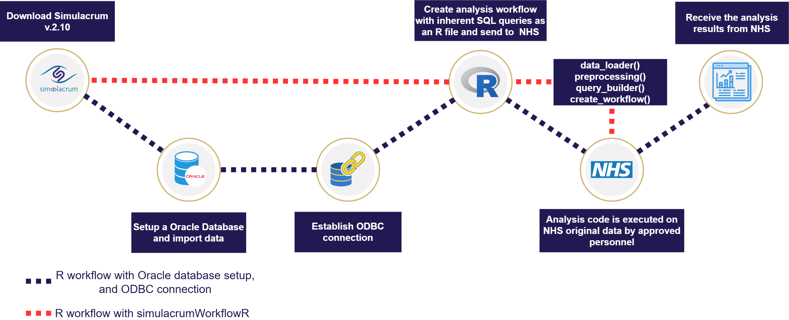

# Summary
The simulacrumWorkflowR package addresses the technical barriers associated with utilizing the Simulacrum through a streamlined workflow for accessing, preprocessing, and validating statistical analyses on the Simulacrum dataset. Our aim is to improve accessibility for researchers and clinicians with limited database expertise. The main function of this package is the `create_workflow()` function, which creates an R script based on the user's input that includes the necessary code for submission and execution on the Cancer Analysis System (CAS) database servers.
# Statement of need 
The    Simulacrum is a synthetic version of the CAS database, enabling the development and testing of code for analysing CAS data which is held by the National Disease Registration Service (NDRS) (@national2023guide  ). CAS data is stored in an Oracle database, requiring SQL queries for data extraction. A common analysis workflow involves querying the database directly from R, extracting data, and further processing it to produce analytical outputs (the R workflow). The latest version of Simulacrum contains information about patient characteristics, tumor diagnosis, systematic anti-cancer treatment, radiotherapy, and genetic testing data (@frayling2023simulacrum). Scripts developed on the Simulacrum can be sent to NDRS for execution on the CAS database.  This involves first adjusting the code (e.g., SQL queries need further processing by NDRS due to 1) structural differences between Simulacrum and CAS, 2) non-public details/specifications of the CAS database and 3) code alignment with NDRS best practices), executing the code, assessing outputs with respect to patient privacy and releasing the data. If this process takes less than 3 hours, it’s free of charge  . If the process is expected to take longer, the NDRS analyst may suggest simplifying the request or redirecting it to NHS England’s data release services (DARS). For complex or recurring requests involving bespoke analysis, one can contact HDI for further assistance. Thus, a streamlined process requires providing easily adaptable and executable code. The advantages of utilizing Simulacrum can be summarized as follows: 

1.	Accelerated research.
2.	Democratization of data.
3.	Improving Privacy. 

Due to Simulacrum prioritizing privacy over fidelity, only some of the statistical properties are preserved, thus results from the Simulacrum should not be used to create real-world evidence. Instead, the dataset is intended for planning, designing, and testing analysis pipelines prior to generating actionable results with CAS data (@bullward2023research). 
The process of accessing the real data through Simulacrum requires users to construct SQL queries for extracting data from the CAS database and R code for analysis. To write and test SQL queries using Simulacrum, users must download CSV files, install a local Oracle database and configure ODBC connections. SQL queries can then be executed from within an R script to extract data from the database for further analysis. Setting up a full Oracle database can be complex, particularly for new users. This presents a barrier to testing the full R workflow using Simulacrum and may discourage users from doing so (@national2022guide). 
The simulacrumWorkflowR package simplifies testing by removing the need to set up an Oracle database or configure ODBC connections. This allows users to create and test the full R workflow, including SQL queries that demonstrate the exact specification and form of the data required from the CAS database and how they integrate into the rest of the R script. This means NDRS can easily make the required adjustments before they are executed on the CAS database (Figure 1). 


Figure 1: Flowchart of the process of running an analysis on the CAS Database using an R workflow tested on Simulacrum and the process of running a similar analysis with the simulacrumWorkflowR package. 

The simulacrumWorkflowR package is, to our knowledge, the first package designed to enhance usability and provide a complete workflow for utilizing the Simulacrum datasets to facilitate access and execution of code for analysis on the CAS database.

# Key functionalities 
Providing a streamlined setup for building the workflow in R. The package includes:

1.	\textbf{Integrated SQL Environment:} Leverages the SQLdf (@grothendieck2017sqldf) package to enable SQL queries directly within R, eliminating the need to set up an external database and ODBC connections by creating a local temporary SQLite database within the R environment. 
2.	\textbf{Query Helper:} Offers a collection of queries custom-made for the Simulacrum dataset  for pulling and merging specific tables. Additionally, the `sqlite2oracle` function assists in translating queries to be compatible with the NHS servers.
3.	\textbf{Helper Tools:} Offers a range of data preprocessing functions for cleaning and preparing the data for analysis, ensuring data quality, and consistency. Key functions include cancer type grouping, survival outcomes, and logging reports. 
4.	\textbf{Workflow Generator:} Generates an R script with the complete workflow. This ensures correct layout and the ability to integrate the necessary code to obtain a workflow suitable for submission to NDRS and execution on the CAS database. 

# Workflow illustration
simulacrumWorkflowR was developed with R version 4.3.3. Installation requires Devtools and relies on dependencies listed in the DESCRIPTION file in the GitHub repository. These dependencies are automatically installed during package installation.

### Installation:
```R
if (!require("devtools")) install.packages("devtools")
devtools::install_github("CLINDA-AAU/simulacrumWorkflowR",
dependencies = TRUE)) 
```

### Loading data:
```R
library(simulacrumWorkflowR)
#Set the path to the directory where the Simulacrum CSV files are located; 
Dir <- “/path/to/simulacrum/csv/files”;
#Import the Simulacrum data files; 
simulacrum_list_df <- read_simulacrum(Dir);
```

### Querying data:
```R
query <- “SELECT * 
          FROM sim_av_patient 
          INNER JOIN sim_av_tumour ON sim_av_patient.patientid = sim_av_tumour.patientid”
merged_data <- query_sql(query)
```

### Generating a reproducible workflow for submission to NHS 
```R
create_workflow( 
libraries = "library(dplyr)", 
query = "select * from sim_av_tumour where age > 50 limit 500;", 
data_management = "cancer_grouping(sim_av_tumour)",
analysis = "model = glm(AGE ~ STAGE_BEST + GRADE, data=data)", 
model_results = "html_table_model(model)", 
Logger_report=TRUE)
```

### Oracle compatibility: 
The `sqlite2oracle` function ensures basic query translation for Oracle databases.


# Limitations 
Data Differences:
- Coverage: Simulacrum reflects diagnoses from 2016–2019, while CAS includes records dating back to 1971. The 2016-2019 restriction needs to be added to the code for running on CAS.
- Structure: Simulacrum has a simplified structure for ease of use, but this differs from the evolving CAS database. Adjustment by NDRS is likely before execution on CAS.

SQLite: While both Oracle and SQLite use SQL syntax, there are notable differences between their syntaxes.  For example, SQLite uses ‘LIMIT’ while Oracle uses ‘ROWNUM’.  The sqldf package's implementation also restricts table creation capabilities within SQLite. Adjustment by NDRS is likely before execution on CAS. Time Management: While Simulacrum facilitates SQL query testing, time estimates for queries may not align with CAS performance due to its larger dataset. Similarly, code adjustments will take time that is unaccounted for in this. Despite this limitation, the package remains useful for benchmarking other components of the R script and identifying performance bottlenecks. 

# Acknowledgements
Jakob Skelmose and Jennifer Bartell acknowledge funding by the Novo Nordisk Fonden (NNF20OC0063268) via the Health Data Science Sandbox (https://hds-sandbox.github.io). Martin Bøgsted and Rasmus Rask Kragh Jørgensen acknowledge funding by the Novo Nordisk Fonden (NNF23OC0083510) via the SE3D project (Synthetic health data: ethical deployment and dissemination via deep learning approaches). We greatly appreciate the feedback we received from Lora Frayling at Health Data Insight.
# References 

