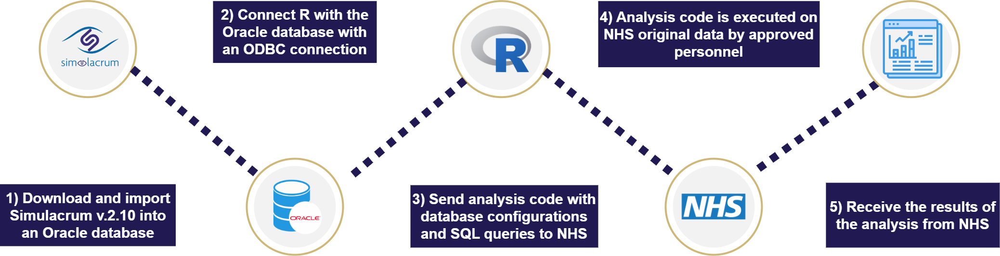

# Summary
The simulacrumR R package addresses the technical barriers associated with utilizing Simulacrum through a streamlined workflow for accessing, preprocessing, and validating statistical analyses on the Simulacrum dataset. Thus, making it more accessible to researchers and clinicians with limited database expertise. The main function of this package is the `create_workflow()` function which creates an R script, based on the user's input, that includes all the necessary code and is compatible for execution on the Cancer Administration System (CAS) database servers.

# Statement of need 
Simulacrum is a synthetic dataset mimicking the Cancer Analysis Service (CAS) Database in England, which is held by the National Disease Registration Service (NDRS) (@national2022guide). Simulacrum is developed by Health Data Insight with support from AstraZeneca and IQVIA. The first version of Simulacrum was published in 2018 and the latest version (Simulacrum V2.1.0.) was published in 2023. The latest version of Simulacrum contains information about patient characteristics, tumor diagnosis, systematic anti-cancer treatment, radiotherapy, and gene testing data (@frayling2023simulacrum). The core innovation is the ability to develop and refine algorithms for statistical analysis using synthetic data while allowing for the execution of these algorithms on the real CAS Database without the need to access sensitive patient data, protecting privacy while facilitating research. Once the algorithm run by NDRS on the real CAS data, researchers receive aggregated results. 
The advantages of utilizing Simulacrum can be summarized as follows: 

1.	Accelerated research.
2.	Democratization of data.
3.	Improving Privacy. 
4.	Eliminating Data Dredging.

However, due to Simulacrum prioritizing privacy over utility, the dataset is primarily suitable for designing and testing analysis pipelines for the CAS data, not generating actionable results (@bullward2023reseach). 
The process of accessing the real data through Simulacrum requires users to download multiple CSV files, install a dedicated Oracle database system locally, configure ODBC connections, and construct SQL queries all within an R workflow (@national2022guide), see Figure 1. 
 


Figure 1: Overview of the process of running an analysis on the CAS Database using an R workflow tested on Simulacrum. 

These technical hurdles limit the accessibility of Simulacrum and reduce the engagement of researchers who could potentially contribute to cancer research. Setting up the database, configuring the ODBC connection, and integrating the components into an R workflow has proven complex and time-consuming. To address these challenges and improve accessibility, we propose the simulacrumR package. Our workflow streamlines the testing of SQL queries by eliminating the need for setting up a dedicated Oracle database or configuring ODBC connections (Figure 2). 


 
Figure 2: Overview of the process of running an analysis on the CAS Database using the simulacrumR package.

The simulacrumR package is, to our knowledge, the first package designed to enhance usability and provide a complete workflow for utilizing the Simulacrum to facilitate access and execution of analysis on the CAS database.

# Key functionalities 
Providing a streamlined setup for building the workflow in R. The package includes:

1.	Integrated SQL Environment: Leverages the SQLdf (@grothendieck2017sqldf) package to enable SQL queries directly within R, eliminating the need for external database setup and ODBC connections by creating a local temporary SQLite database within the R environment. 
2.	Query Helper: Offers a collection of queries custom-made for the Simulacrum, for pulling and merging certain tables. Additionally, does the `sqlite2oracle` function assist in translating queries to be compatible with the NHS servers.
3.	Helper Tools: Offers a range of data preprocessing functions for cleaning and preparing the data for analysis, ensuring data quality and consistency. Key functions include cancer type grouping, survival status, and logging. 
4.	Workflow Generator: Generates an R script with the complete workflow. Ensuring correct layout and the ability to integrate all the necessary code to obtain a workflow suitable for submission to the NHS and execution on the CAS database. 

# Workflow illustration
simulacrumR was developed with R version 4.3.3. Installation requires Devtools and relies on dependencies listed in the DESCRIPTION file on GitHub. These dependencies are automatically installed during package installation.

### Installation:
```{R]
if (!require("devtools")) install.packages("devtools")
devtools::install_github("CLINDA-AAU/simulacrumR",
dependencies = TRUE)) 
```

### Loading data:
```{R}
library(simulacrumR)
#Set the path to the directory where the Simulacrum CSV files are located 
Dir <- “/path/to/simulacrum/csv/files”
#Import the Simulacrum data files 
Data_frames <- read_simulacrum(Dir)
```

### Quering data:
```{R}
query <- “SELECT * FROM sim_av_patient INNER JOIN sim_av_tumour ON sim_av_patient.patientid = sim_av_tumour.patientid”
merged_data <- query_sql(query)
```
### Generating a Reproducible Workflow for NHS Submission 
```
create_workflow( 
libraries = "library(dplyr)", 
query = "select * from sim_av_patient where age > 50 limit 500;", 
data_management = "cancer_grouping(sim_av_tumour)”,
analysis = "model = glm(Y ~ x1 + x2 + x3, data=data)",
model_results = "html_table_model(model)", 
Logger_report=TRUE)
```
### Oracle Compatibility: 
The `sqlite2oracle` function ensures basic query translation for Oracle databases.

### Logging: 
In the event of an error on NHS servers while executing the analysis pipeline, the `time_management` function and the base R `sink` function will generate a comprehensive log to facilitate seamless debugging.

# Limitations 
Expertise: As Simulacrum is designed to mimic real cancer patient data, a certain level of domain expertise is necessary for any meaningful analysis.

SQLite: The simulacrumR library leverages the sqldf package to provide users with a streamlined SQL interface for interacting with the Simulacrum dataset. However, the utilization of SQLite introduces a consideration: potential differences in SQL syntax compared to Oracle. While SQLite and Oracle share a common foundation in SQL, variations in certain queries exist. Table 1 highlights some key variations:  

| Feature | SQLite | Oracle |
|---|---|---|
| Case Sensitivity | Doesn't matter if you use upper or lower case for commands. Example: `select`, `Select`, `SELECT`. | Uppercase. Example: `SELECT` |
| Limits on Results | Use `LIMIT`. `LIMIT 50;` | Use `ROWNUM`, `OFFSET`, and `FETCH NEXT`. `WHERE ROWNUM => 50;` |

Table 1: An overview of the difference between basic SQL commands for SQLite and Oracle.  

The difference between the syntax is important to consider when writing the queries to the SQLite database and submitting the queries for execution on an Oracle server. To ensure compatibility with the servers at NHS, it is highly recommended to minimize SQL queries. 

Compute: While the time management function can provide an indication of the analysis being able to pass the three-hour time limit on NHS servers (@national2022guide) , there will likely be a difference between the user's local machine and the servers of NHS in terms of the time for the computation. It Is advised to divide the analysis into parts, to make sure some of the analysis can be returned. An example of divided analyses can be found in @nielsen2024simulacrum.

# References 
